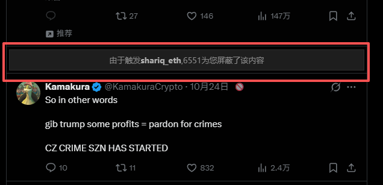
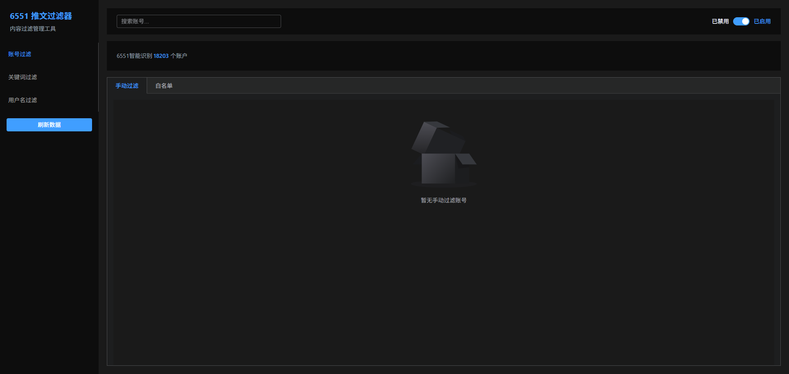

# 6551 推文过滤器 Chrome 插件

一个用于自动过滤 Twitter/X 推文的 Chrome 浏览器插件，支持账号、关键词和用户名三种过滤方式。

## 功能特性

- **智能过滤**：支持账号、关键词、用户名三种过滤方式
- **实时过滤**：自动隐藏符合过滤规则的推文和回复
- **数据源**：从远程加载过滤数据（WASM + JSON）
- **手动管理**：支持手动添加过滤规则和白名单
- **统计展示**：实时显示已过滤推文数量和详细列表

## 功能截图

### 插件弹窗
显示过滤统计和快速开关

### 过滤效果
被过滤的推文会显示占位提示

### 过滤列表
右侧显示已过滤的推文统计

### 管理界面
完整的过滤规则管理界面

